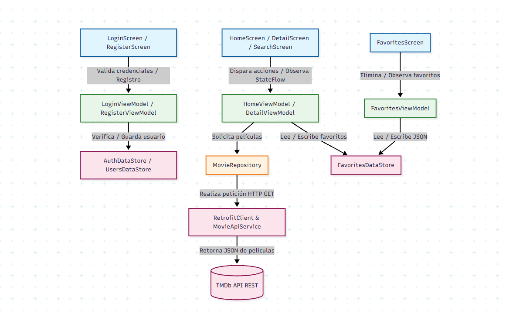
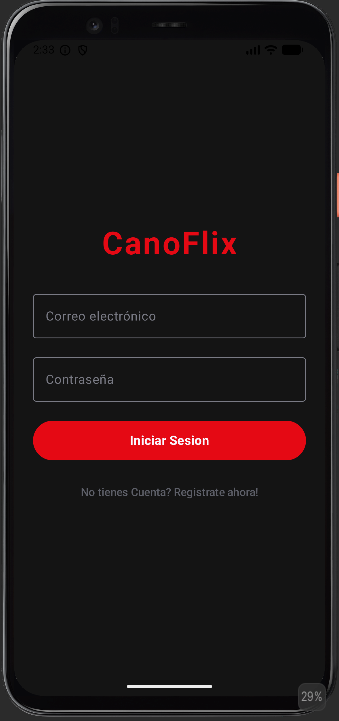
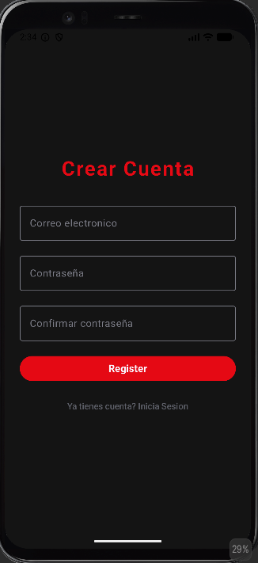
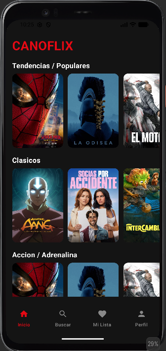
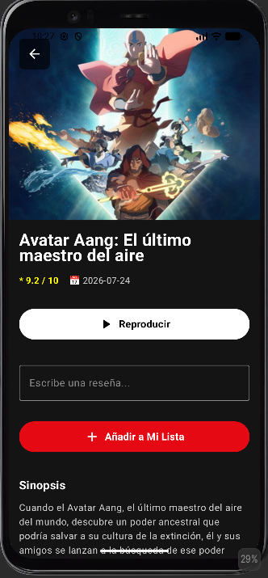
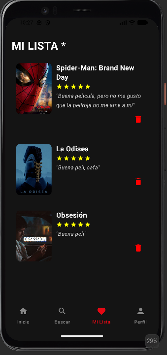
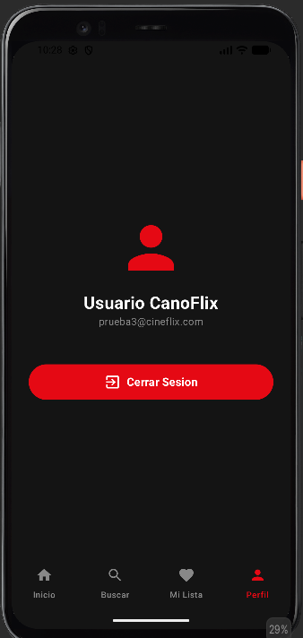
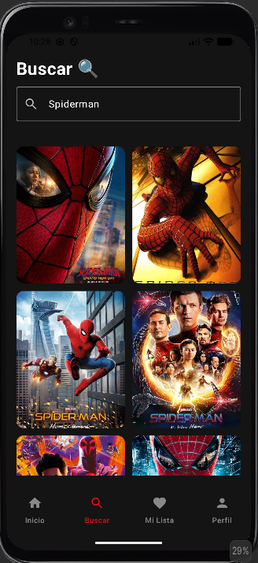
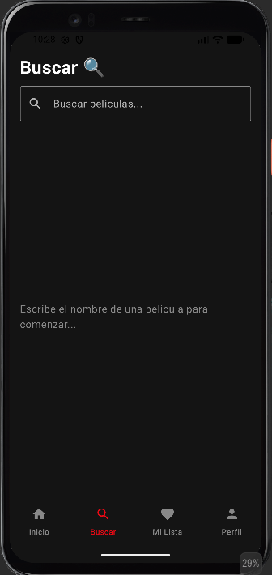

#[Screenshots]
###  Architecture


###  Login display


###  Register display


###  Home display


###  Details Movies Display


###  Favorites movies display


###  Profile display


###  Search display

###  SEARCH display


# 🎬 CanoFlix

¡Hola! Bienvenido a **CanoFlix**, mi aplicación móvil de catálogo y descubrimiento de películas inspirada en **Netflix**, desarrollada desde cero para afianzar y dominar los conceptos clave del desarrollo Android moderno.

Este proyecto nació como un desafío de aprendizaje avanzado para llevar la arquitectura y las buenas prácticas al siguiente nivel.

---

## 📱 Lo que encontrarás en CanoFlix

- **🔐 Autenti cación Real Multi-Usuario:** Registro e inicio de sesión conectados a una base de datos local basada en JSON. ¡Cada usuario tiene su propia cuenta!
- **🍿 Catálogo Estilo Netflix:** Pantalla principal con carruseles horizontales (*Tendencias, Clásicos, Animación y Acción*) con scroll fluido.
- **🔍 Buscador en Tiempo Real:** Encuentra cualquier película al instante escribiendo su nombre.
- **⭐ Mi Lista Personalizada:** Guarda tus películas favoritas, escribe tus propias **reseñas/comentarios** y puntúalas con **estrellas (1 a 5)**. ¡Totalmente privado e independiente para cada usuario!
- **👤 Perfil y Sesiones:** Mantén la sesión iniciada de forma segura mediante DataStore Preferences.
- **🗺️ Navegación Fluida:** Footer inferior (*Bottom Navigation Bar*) con 4 pestañas (*Inicio, Buscar, Mi Lista, Perfil*).

---

## 🏗️ Estructura de la Arquitectura

Para mantener un código limpio, escalable y ordenado, el proyecto sigue una **Clean Architecture** dividida en capas:

```text```
com.arigondev.canoflix/
│
├── 📂 data (Capa de datos y acceso externo/local)
│    ├── remote/       --> Llamadas a la API de TMDb con Retrofit y DTOs
│    ├── local/        --> DataStore Preferences para sesiones y JSON de usuarios/favoritos
│    └── repository/   --> Repositorio mediador entre la red y la app
│
├── 📂 domain (Capa de negocio / Modelos limpios)
│    └── model/        --> FavoriteMovie y UserAccount
│
└── 📂 ui (Capa de presentación y vistas con Jetpack Compose)
     ├── auth/         --> Pantallas de Login y Registro
     ├── home/         --> Catálogo principal estilo Netflix
     ├── search/       --> Pantalla de búsqueda
     ├── favorites/    --> Pantalla "Mi Lista" con reseñas y estrellas
     ├── profile/      --> Pantalla de perfil y cierre de sesión
     ├── navigation/   --> CanoFlixNavGraph y MainScreen (Footer)
     └── [app/src/main/java/com/arigondev/canoflix/ui/theme/]

🛠️ Tecnologías Utilizadas
•
Kotlin & Jetpack Compose (UI declarativa y moderna).
•
MVVM & Clean Architecture (Separación total de responsabilidades).
•
Coroutines & Flow / StateFlow (Asincronismo reactivo).
•
Retrofit 2 & Gson (Consumo de la API REST de TMDb - The Movie Database).
•
DataStore Preferences (Persistencia local rápida y eficiente).
•
Coil (Carga asíncrona de imágenes y pósters).
•
Jetpack Navigation (Navegación declarativa entre pantallas).
🚀 Cómo probarlo
1.
    Clona este repositorio en tu computadora.
2.
    Obtén una clave API gratuita en TMDb (The Movie Database).
3.
    Pega tu API Key en el archivo MovieRepository.kt:
    Kotlin
    private val apiKey = "TU_API_KEY_AQUI"
4.
    Abre el proyecto en Android Studio, compílalo y ejecútalo en tu emulador o dispositivo físico.
💡 Sobre el proyecto
Este proyecto fue construido paso a paso como parte de mi evolución en Android, aprendiendo haciendo y entendiendo cada línea de código. ¡Espero que te guste tanto como a mí desarrollarlo! 🍿🎬

***

¡Este formato mantiene tu toque personal, explica claramente la arquitectura, se ve súper humano y queda genial en tu perfil de GitHub! ¿Te gusta cómo ha quedado?